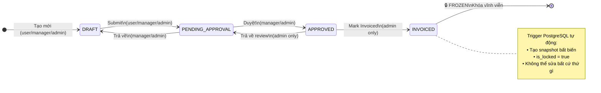
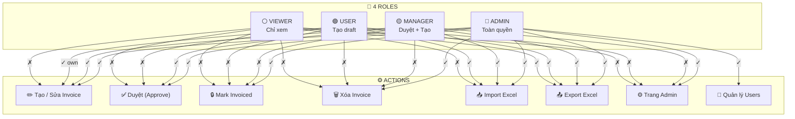
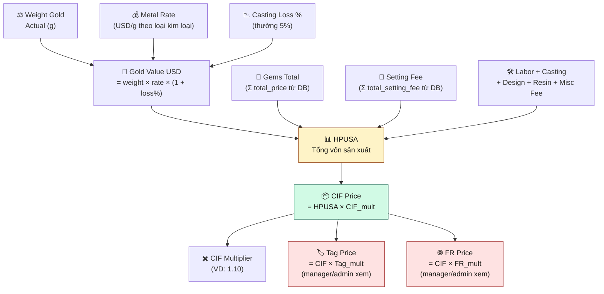
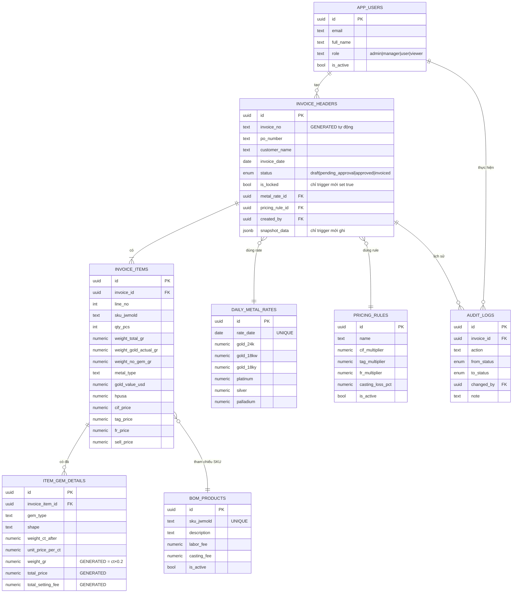
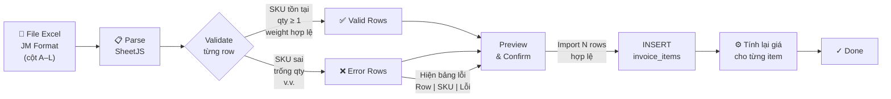
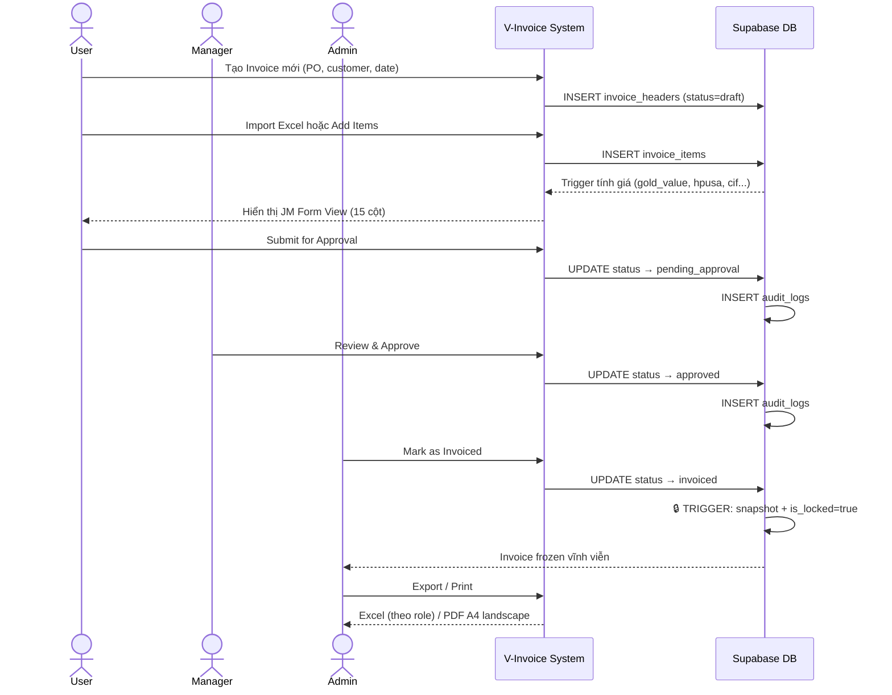

# V-Invoice — Sơ Đồ Hệ Thống (Stakeholder Review)

> **Mục đích:** Tài liệu tổng quan cho stakeholder xem xét nghiệp vụ
> **Cập nhật:** 2026-05-25

---

## 1. VÒNG ĐỜI INVOICE (Status Lifecycle)



---

## 2. PHÂN QUYỀN THEO ROLE



---

## 3. LUỒNG TÍNH GIÁ (Pricing Chain)



---

## 4. CỘT GIÁ — HIỂN THỊ THEO ROLE

| Cột giá | viewer | user | manager | admin |
|---------|:------:|:----:|:-------:|:-----:|
| Gold Value USD | ✓ | ✓ | ✓ | ✓ |
| HPUSA | ✓ | ✓ | ✓ | ✓ |
| CIF Price | ✓ | ✓ | ✓ | ✓ |
| **Tag Price** | ✗ | ✗ | ✓ | ✓ |
| **FR Price** | ✗ | ✗ | ✓ | ✓ |
| **Sell Price** | ✗ | ✗ | ✓ | ✓ |
| **Discount %** | ✗ | ✗ | ✓ | ✓ |
| **After Discount** | ✗ | ✗ | ✓ | ✓ |

> **Lý do:** User và Viewer chỉ cần thấy giá thành (HPUSA, CIF). Giá bán, tag, FR là thông tin nhạy cảm dành cho quản lý.

---

## 5. SƠ ĐỒ DỮ LIỆU (Entity Relationships)



---

## 6. LUỒNG IMPORT EXCEL



**Quy tắc:**
- Invalid rows **không** chặn valid rows — partial import OK
- Fees (labor, casting...) **tự động copy** từ `bom_products`
- `line_no` **tự động gán** server-side (MAX + 1)

---

## 7. JM FORM VIEW — 15 CỘT

| # | Cột | Ghi chú |
|---|-----|---------|
| 1 | **No.** | Số thứ tự — sticky |
| 2 | **SKU JWMold** | Nền vàng `#FEF3C7` — sticky |
| 3 | Qty Pcs | |
| 4 | Description | |
| 5 | Class | |
| 6 | Sub Class | |
| 7 | **Notes** | 🔴 Đỏ nếu chứa "ba sao" |
| 8 | Wt Total (g) | |
| 9 | **Wt Gold (g)** | Nền vàng nhạt `#FFFBEB` |
| 10 | Wt No Gem (g) | Tính tự động |
| 11 | Metal Type | |
| 12 | Gold Value USD | Tính tự động |
| 13 | **HPUSA** | Tính tự động, in đậm |
| 14 | CIF Price | Tính tự động |
| 15 | **Tag Price** | ⚠️ Chỉ manager/admin |

> **FR Price** không hiển thị trong JM View — chỉ có trong Detail View và Export.

---

## 8. LUỒNG NGHIỆP VỤ ĐẦY ĐỦ



---

## 9. CÁC RÀNG BUỘC NGHIỆP VỤ QUAN TRỌNG

| # | Quy tắc | Chi tiết |
|---|---------|---------|
| 🔒 | **Invoice locked = bất khả xâm phạm** | Sau khi `invoiced`, không ai có thể sửa — kể cả admin |
| 📸 | **Snapshot bất biến** | Khi `invoiced`, PostgreSQL trigger tự lưu toàn bộ dữ liệu vào snapshot |
| ⚙️ | **Tính giá server-side** | Giá không bao giờ tính ở client — luôn server tính sau mỗi thay đổi |
| 💎 | **GENERATED columns** | `weight_gr`, `total_price`, `total_setting_fee` của đá quý do PostgreSQL tính |
| 🗂️ | **1 active pricing rule** | Tại một thời điểm chỉ có 1 pricing rule active |
| 🚫 | **Không xóa metal rate đang dùng** | Nếu invoice đang ref → 409 Conflict |
| 👤 | **Role trong DB, không trong JWT** | Role lấy từ `app_users.role`, không phải từ Supabase JWT claims |

---

## 10. TRANG ADMIN

| Trang | Mô tả | Quyền |
|-------|-------|-------|
| `/admin/metal-rates` | CRUD tỷ giá vàng/bạch kim theo ngày | Admin |
| `/admin/pricing-rules` | CRUD bộ nhân CIF/Tag/FR + casting loss | Admin |
| `/admin/products` | Quản lý danh mục SKU (bom_products) | Admin |
| `/admin/users` | Quản lý tài khoản và phân quyền | Admin |
| `/import` | Import Excel JM format vào invoice | Admin/Manager/User |
| `/dashboard` | Thống kê tổng quan + recent invoices | Tất cả |

---

## 11. STACK KỸ THUẬT

```
Browser
  └── Next.js 14 (App Router + TypeScript)
      ├── Thiết kế: CSS Variables, Cormorant Garamond, Jost, JetBrains Mono
      ├── Icons: Font Awesome 6
      └── Excel: SheetJS (xlsx)

Server
  └── Next.js API Routes (serverless)
      └── Supabase Service Role (bypass RLS)

Database
  └── Supabase PostgreSQL
      ├── RLS (Row Level Security)
      ├── Realtime (invoice_items, item_gem_details)
      ├── Trigger (trg_snapshot_invoice)
      └── RPC Functions (get_invoice_list, get_dashboard_stats...)

Deploy
  └── Vercel (Next.js) + Supabase (PostgreSQL)
```
